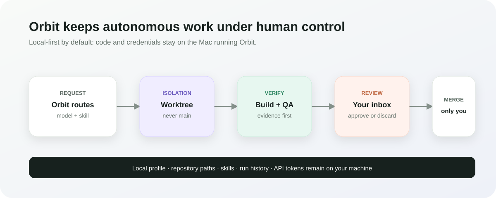
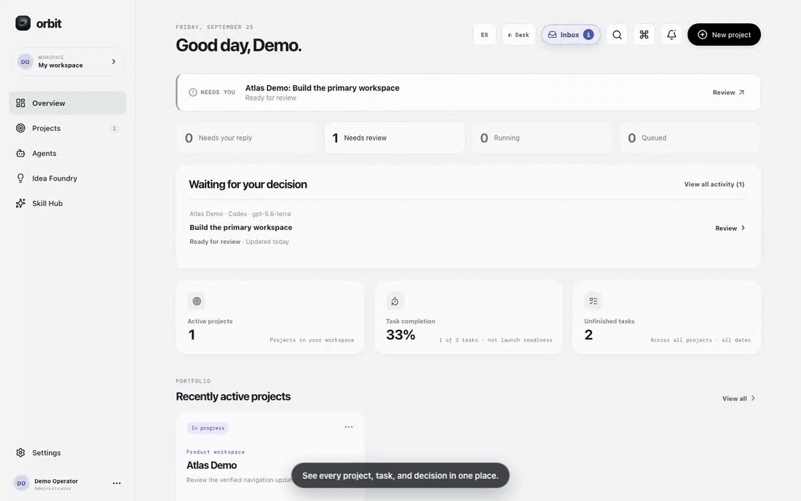

# Orbit Agentic OS

> Early-access alpha for macOS. Orbit is free and open source; optional AI providers, hosting, and tunnels may charge according to their own plans.

Orbit Agentic OS is a local-first control plane for a portfolio of repositories and AI agents. It keeps projects, local repository paths, run history, provider preferences, skills, and secrets on the machine running Orbit.



## See Orbit in action



Track every project, choose the provider and exact model for each task, and
approve verified changes from one local control plane. This recording uses only
the safe example workspace described in [docs/DEMO.md](docs/DEMO.md).

## Demo flow

1. Create a local profile in the welcome screen.
2. Connect a repository from **Agents** and optionally its private GitHub mirror.
3. Optimize a prompt locally, select an approved skill if needed, and dispatch it to one or more models.
4. Review the isolated worktree, files changed, test result, and model output before integrating anything.

Code agents use an isolated Git worktree, and Orbit never pushes, merges, or deletes a repository automatically. Production deployments are always an explicit, locally confirmed action. Orbit supports Vercel, Netlify, Cloudflare Pages, Railway, and a restricted custom command; provider tokens stay in the local `.env` file.

## What works today

- Create, update, and remove project records without touching their repositories.
- Connect a local Git repository and optionally inspect a private GitHub repository, including commits and open pull requests.
- Run Codex, Claude, Ollama, or Gemini. Codex/Claude edits happen in `orbit/<run-id>` worktrees and finish in review.
- Route simple local changes to Ollama and flag larger local tasks for a stronger model.
- Compare two or three available models in parallel.
- Use reusable project workflows for focused implementation, verification repair,
  launch-readiness evidence, safe skill review, and bounded model comparisons.
- Structure a Project Brain without overwriting existing notes: durable goals,
  decisions, risks, and runtime compatibility stay in the local project memory.
- Scan a connected repository read-only for agent instruction files, project
  skills, MCP configuration filenames, and GitHub Actions signals. Orbit never
  returns the content of those files or their credentials.
- Use the Model Lab to compare two or three available models against the same
  bounded task. It records verification and attention signals rather than
  declaring a subjective “winner.”
- Optimize a prompt before dispatch: instant local heuristic cleanup, then optional Ollama-only compression. You review and can edit the result before it is sent.
- View run status, results, worktree location, and send a follow-up instruction after a result.
- Configure a local profile, sign out/change profile, and switch between English and Spanish. The chosen language stays in the browser.
- Store a Gemini API key locally through the UI; it is never returned by the API.
- Import GitHub skills only into a local pending-review library. Every skill has a SHA-256 integrity hash and requires human approval.
- Attach an approved skill explicitly to a run. Its name and hash are recorded for audit, while Orbit's immutable safety rules retain precedence.
- Pause a run for approval when an agent changes what a project installs (npm, Python, Rust, Go, Ruby, PHP, .NET, Maven, Gradle, Dart/Flutter, Swift, Elixir), then install exactly the approved list in the run's worktree. Approve or reject from the Inbox or Telegram. Declared dependencies of a newly connected npm or Python project are installed automatically.
- Build and test every project in a worktree with its own toolchain before review, including monorepos.
- Turn an idea into a reviewed plan and a new local Git repository with the Idea Foundry, and optionally start the first task.
- Use global search with `Cmd/Ctrl+K`, create a project with `Cmd/Ctrl+N`, navigate with `Cmd/Ctrl+1…5`, and toggle local dark mode.
- Download a local data archive at `GET /api/backup`. It contains runtime data only on your Mac and is never added to Git.

## Run locally

Requirements: macOS, Node.js `^20.19.0 || >=22.12.0`, and Git. Codex, Claude, Ollama, and Gemini are optional integrations.

```bash
npm install
npm run dev:orbit
```

Open `http://127.0.0.1:5173`.

`npm run dev:orbit` starts both the local control plane and the visual app. Use
`Ctrl+C` once to stop both. If you prefer separate terminals, use `npm run
server` and `npm run dev`.

Before the first run, or when a provider is not detected, use the read-only
environment check:

```bash
npm run doctor
```

It never reads or prints secret values. For the guided first-run flow, see
[docs/FIRST_RUN.md](docs/FIRST_RUN.md).

For a production-style local run:

```bash
npm run build
npm start
```

## Connect a repository

1. In Orbit, open **Agents**.
2. Choose the folder button next to a project and select its local Git repository. You never need to paste a full path manually.
3. Optionally enter `owner/repository` for its GitHub mirror.
4. Save, then use **Review GitHub** to verify access.

For private GitHub repositories, authenticate GitHub CLI (`gh auth login`) or place a fine-grained read-only `GITHUB_TOKEN` in the local `.env` file. Never commit that file.

## Providers and credentials

- **Codex / Claude:** Orbit detects the local CLI and its existing authenticated session. It uses that provider's existing usage/subscription policy; Orbit does not copy its credentials.
- **Ollama:** start Ollama locally, then Orbit discovers installed models. It stays on `127.0.0.1`.
- **Gemini:** Settings lets you paste an API key. It is written to the local ignored `.env` file with owner-only permissions.
- **Deployment targets:** add only the token for the provider you use to your local `.env`: `VERCEL_TOKEN`, `NETLIFY_AUTH_TOKEN`, `CLOUDFLARE_API_TOKEN`, or `RAILWAY_TOKEN`. The **Deploy** picker always requires a production confirmation; a custom command is restricted to `npm`, `pnpm`, `yarn`, `bun`, `npx`, or `node`.

Provider availability is detected at runtime. Disabled providers are ignored by automatic routing. Orbit itself is free; usage of third-party AI providers, deployment hosts, and tunnel services may incur charges from those providers.

## Dependency approval

Agents are told not to install packages. When one needs a package, it declares
it in the project's manifest and Orbit takes over when the agent finishes:

1. Orbit compares every changed dependency file in the worktree with the commit
   the run started from. It understands `package.json`; `requirements*.txt`,
   `pyproject.toml` (PEP 621, Poetry, uv, dependency groups) and `Pipfile`;
   `Cargo.toml`; `go.mod`; `Gemfile`; `composer.json`; .NET project files and
   `Directory.Packages.props`; `pom.xml`; Gradle build files and version
   catalogs; `pubspec.yaml`; `Package.swift`; and `mix.exs`.
2. The run pauses for new packages, version changes, install scripts (npm and
   Composer), new package indexes or repositories, Cargo `[patch]`, Go
   `replace`, uv source overrides, Composer plugin permissions, Maven/Gradle
   plugins, and Python build requirements. Removals never pause a run.
3. Lockfiles the agent edited by hand, registry or tool configuration
   (`.npmrc`, `pip.conf`, `gradle-wrapper.properties`, `nuget.config`, ...) and
   files Orbit cannot read (`setup.py`, gemspecs) are shown as line changes.
4. The Inbox lists each change with its registry's description and license
   (npm, PyPI, crates.io, the Go module proxy, RubyGems, Packagist, NuGet,
   Maven Central / Google Maven, pub.dev, Hex). Packages that do not exist on
   the public registry are flagged, as are local, Git, URL, and private sources.
   Private npm registries from `.npmrc` are used for lookups.
5. **Approve & install** installs that exact list in the worktree with the
   project's own tool, updating its lockfile as part of the reviewed change,
   then runs the checks. **Approve without install scripts** is offered where
   the package manager supports it. If the install fails, the run returns to
   the Inbox with the error.
6. **Reject** sends Codex or Claude a follow-up to finish without those changes,
   with your optional note.

With Telegram connected, the authorized user also receives each request and can
answer with `/approve <code> <token>` (add `noscripts` to skip install scripts),
`/reject <code> <note>`, or `/deps` to list what is waiting.

When a connected npm or Python project declares dependencies but was never
installed, Orbit installs them once in the main repository, only into folders
the repository ignores and without writing a lockfile.

Set `ORBIT_REGISTRY_LOOKUPS=off` on a computer without internet access.

## Completion Gate checks

Before a run reaches review, Orbit builds and tests every project it finds in
the worktree (up to two folders deep, so `web/` and `api/` are both checked),
each with its own toolchain: npm/pnpm/Yarn/Bun scripts, Python (syntax check,
then pytest or unittest), Cargo, Go, Bundler (RSpec or Rake), Composer or
PHPUnit, `dotnet`, Maven, Gradle, Dart/Flutter, SwiftPM, Mix, or a Makefile's
`build`/`test` targets. A missing toolchain or an empty test run is reported as
skipped, never as verified. Files the checks create that Git does not ignore
(build output, vendor folders) are removed and never merged. Visual QA runs for
projects with a `dev` script.

## Idea Foundry

Describe an idea and Orbit drafts a first-version plan with whichever model you
connected (or Ollama, which keeps the idea on this computer): target users,
scope and what to leave out, screens, data model, a stack chosen for the idea,
risks, pricing as a hypothesis to test, ways to validate demand, and 5–8
agent-sized tasks with acceptance criteria. Tasks about deploying or adding
secrets are removed; those stay with you. Without a model you get a clearly
labelled fill-in template, never a made-up analysis.

Everything is editable. **Create project** can create a new Git repository in a
folder you choose (inside your home folder) with `README.md`,
`docs/PRODUCT_BRIEF.md`, and a `.gitignore`, connect it, and start the first
task with Codex or Claude.

## Skill safety model

Skills are untrusted input. Orbit can discover `SKILL.md` packages from a GitHub repository or accept a direct `.md` / `.json` file from `github.com` or `raw.githubusercontent.com`. It scans the text instructions and helper scripts, limits package size, shows supporting files for review, and stores a SHA-256 package hash.

The workflow is: **inspect → pending review / blocked → explicit approval → local storage**. Approval does not silently grant a skill access to credentials or to the internet. Keep imported skills local; `data/skills/` is ignored by Git.

When an approved skill is selected for a run, Orbit activates it for that run only. Codex receives a temporary project skill under `.agents/skills/`; Claude receives the same package under `.claude/skills/`. Both can load `SKILL.md`, references, scripts, and assets using their normal native skill discovery. Orbit removes the temporary package before calculating the code diff, so it is never merged into the project. Direct local and API models do not provide a native skill loader, so Orbit supplies the reviewed package as bounded model context instead. Follow-ups and pipeline coding stages keep the same selected skill and integrity hash.

## Security Center

Each project has a local Security Center that inventories source-like files for credential-shaped values, environment-file handling, manifests and lockfiles, privacy and support routes, macOS controls, and active public preview tunnels. Opening the center records a fresh local evidence snapshot; a manual refresh can run `npm audit --omit=dev` for npm projects with a lockfile. Any prior critical dependency finding stays blocked when repository evidence changes until a successful new audit resolves it.

Privacy review records are tied to the exact local evidence shown to the responsible owner. They expire when that evidence changes and organize delivery evidence only; they are never legal approval or a compliance certification. The downloaded Markdown report is pinned to the snapshot displayed in the Security Center.

It is an engineering evidence inventory, not a penetration test, legal opinion, compliance certification, or guarantee that every secret or vulnerability has been found. A dependency result becomes stale when its manifest or lockfile changes and needs a fresh scan.

## Local data and privacy

Runtime data lives under `data/` and is excluded from Git: project records, profile, provider settings, runs, and imported skills. The committed `data/projects.example.json` is only a safe example.

Before publishing a fork, copy the source tree without `.env` or `data/`, then add your own credentials locally.

## Personal installation and Community source

Orbit supports keeping one powerful personal installation while maintaining a clean
Community checkout for GitHub. By default, runtime state is stored in `data/` and
is ignored by Git. For a stronger separation, make a safe copy of your current
profile into a private directory outside the checkout:

```bash
npm run personal:migrate-data -- --to "$HOME/.orbit/personal"
```

The command never removes the original `data/` folder. After confirming that the
copy is correct, add this to your private `.env` file and restart Orbit:

```bash
ORBIT_DATA_DIR=/Users/your-name/.orbit/personal
```

An empty external data directory is initialized from `data/projects.example.json`.
Do not commit the external directory, `.env`, run logs, worktree paths, or backups.

### Prepare a safe GitHub release

Before staging files or creating a public repository, run:

```bash
npm run release:check
```

It checks the files Git would publish for known secret formats and rejects local
runtime state such as `.env`, run histories, imported skills, and evidence files.
It does not upload, change, or delete any file.

For the complete production-dependency and release-boundary check, run:

```bash
npm run security:check
```

### v0.3.0-alpha release scope

This alpha adds **Project Intelligence**: a reusable workflow library,
structured local Project Brain sections, a read-only compatibility scanner, and
the Model Lab for evidence-led comparisons. It does not change Orbit's safety
boundary: skills remain explicitly approved, code changes remain in isolated
worktrees, and no repository configuration is adopted automatically.

## Verification

Run these checks after changes:

```bash
node --check server.mjs
npm run build
curl http://127.0.0.1:8787/api/health
```

The API is bound to `127.0.0.1`; it is not exposed to your LAN by default.

## Alpha status

Orbit Community is currently an early-access macOS alpha. It is tested in CI on Linux for source integrity and with local macOS-oriented runtime features such as worktrees, previews, and optional tunnels. Review every agent change before merging, keep personal data outside the checkout, and use a disposable project first.

## License

Orbit Agentic OS is licensed under the GNU Affero General Public License v3.0 only (`AGPL-3.0-only`). See [LICENSE](LICENSE) for the complete terms.

## Demo

The safe, reproducible walkthrough for a public demo is in
[docs/DEMO.md](docs/DEMO.md). It uses the example project only; do not record
real repository paths, API keys, prompts, client portals, or active runs.

Maintainers can follow the complete public-release procedure in
[docs/RELEASE.md](docs/RELEASE.md).
Non-read API routes reject browser requests from non-local origins.

## Current boundary

Orbit is single-user and local-first. A future multi-user/cloud edition would need real authentication, encrypted server-side secret storage, per-user authorization, and a separate execution worker. Do not expose this local server to the internet.
